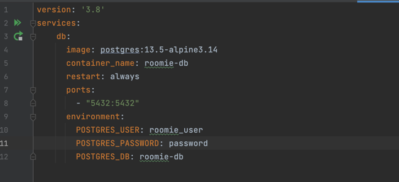
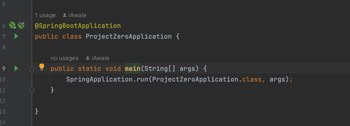

# project-zero

## Description
    Spring backend for *Insert app name here* 

## How to run the backend
1. Install IDE of your choice (IntelliJ/Eclipse) and Java 11. 
2. Install [Docker](https://docs.docker.com/get-docker/) and make sure it is running.
3. Run docker-compose.yaml on intelliJ or `docker compose` up on a terminal. This will run an image with postgres and set it up with necessary credentials. 

4. Start application.  

## How to test everything works end to end (Temporary)
- Test with POST request to localhost:8080/users and an empty body. 
- Then do GET request to localhost:8080/users to see a response from db.
- If everything works, you're good to go!